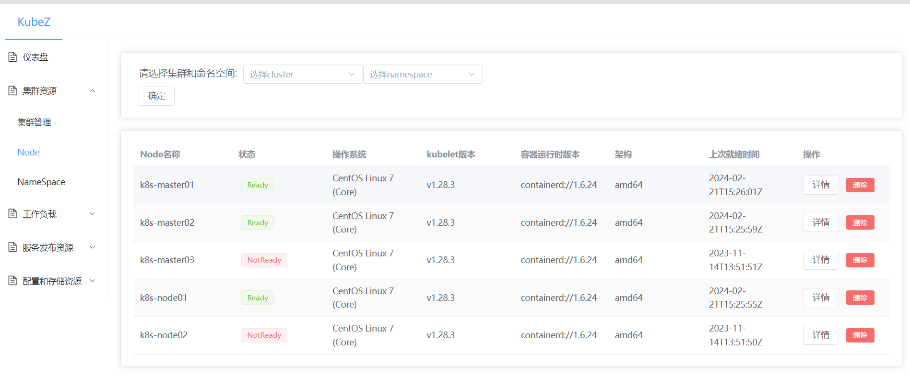
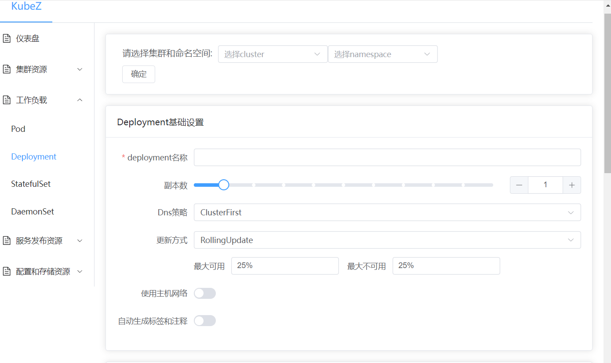
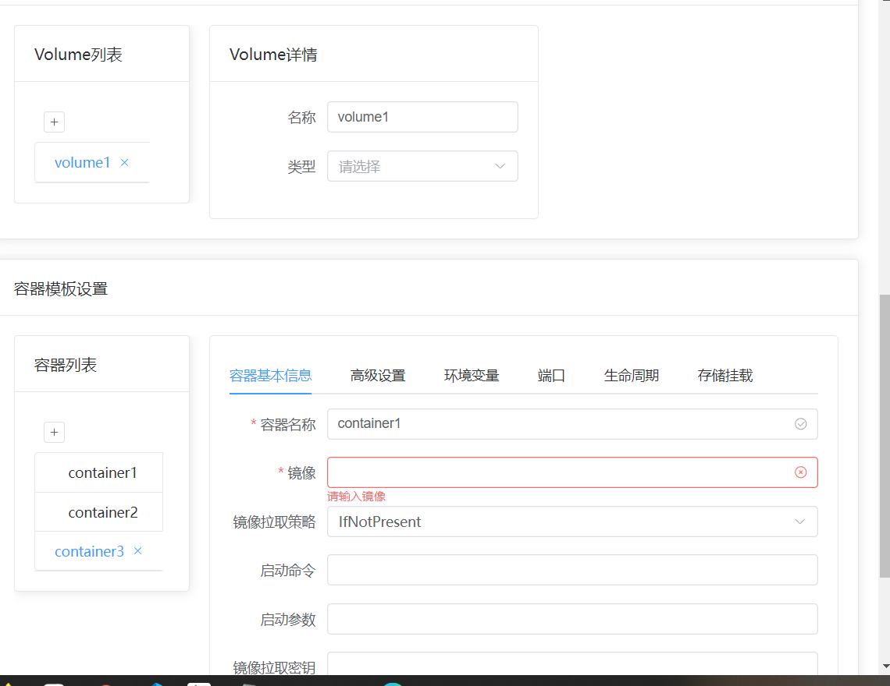

# KubeZ - 多集群k8s管理平台
KubeZ是一个多集群k8s管理平台,采用前后端分离架构,使用vue和go编写,可以简化k8s操作难度

演示地址：[演示地址](http://107.148.0.71:32759/)

部署文档：[deploy.md](doc/deploy.md)

前端栈：vue3，element-plus，axios，pinia，vue-route
后端栈：go，gins，go-client，logrous

目前实现的功能如下:

* 添加、管理多个集群
* 查看、创建、删除常用资源：如Pod，Deployment，Svc，ConfigMap等
* 交互式yaml生成器：通过填写表单生成yaml文件并创建资源
* 部分资源的编辑

未来可能会更新的功能有：

* in-cluster集群配置
* 从env读取配置信息
* 仪表盘
* 创建资源时支持更多特性
* 管理员登录
* 用户组鉴权
* 跨集群资源复制
* 自动调度
* 服务网格、边车容器等高级功能
* 可视化SDN
* ……

目前bug比较多,持续修补中...

### 预览图

